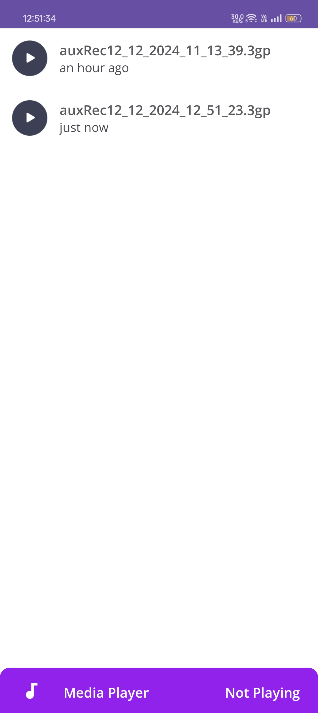

# **AuxRecorder**

**AuxRecorder** is a feature-packed Android application designed for audio recording and playback. This intuitive app provides users with a seamless experience to capture high-quality audio, manage recordings efficiently, and enhance the user experience through elegant UI design and modular functionality.

---

## **Table of Contents**

1. [Features](#features)  
2. [Screenshots](#screenshots)  
3. [Installation Instructions](#installation-instructions)  
4. [Usage](#usage)  
5. [Code Overview](#code-overview)  
6. [Technology Used](#technology-used)  
7. [License](#license)  
8. [Author](#author)  

---

## **Features**

- **Audio Recording**: Simple, quick, and efficient recording of high-quality audio.  
- **Playback Controls**: Play, pause, and resume recordings with ease.  
- **Recording Management**: Organize and view saved audio recordings efficiently.  
- **Time Ago Feature**: Display when recordings were made (e.g., "2 hours ago").
- **Intuitive UI**: Simplified navigation with a modern and user-friendly interface.
- **Error Handling**: Handles permission issues, storage access, and invalid operations gracefully.  

---

## **Screenshots**

<p align="center">
    
    
    
    
    
</p>

---

## **Installation Instructions**

### **Requirements**

- Android Studio installed on your machine.  
- A physical or virtual Android device with Android API level 21 (Lollipop) or higher.

### **Setup**

1. **Clone the repository**:  
   ```bash
   git clone https://github.com/YourUsername/AuxRecorder.git
   ```
2. **Open the project in Android Studio**.  
3. **Run the app** on an emulator or connected Android device.

---

## **Usage**

1. **Record Audio**:  
   - Tap the record button to start recording audio.  
   - Tap again to stop and save the recording.

2. **View Recordings**:  
   - Navigate to the recording list by selecting it from the button located to right side of record button.  
   - List shows all saved recordings along with the time they were made.

3. **Playback**:  
   - Tap on any saved recording to play it.  
   - Use playback controls for pause, resume, and stop functionalities.

---

## **Code Overview**

### **1. MainActivity.java**  
- **Purpose**: Serves as the main entry point and manages the navigation between fragments.  
- **Key Features**:  
  - Hosts `RecordFragment` and `RecordListFragment`.  
  - Manages interactions between fragments.

### **2. SplashScreen.java**  
- **Purpose**: Displays a splash screen with a delay before transitioning to the main app screen.  
- **Key Features**:  
  - Introduces an animated splash screen during app launch.

### **3. TimeAgo.java**  
- **Purpose**: Provides functionality to convert timestamps into human-readable time differences.  
- **Key Features**:  
  - Returns "x minutes ago", "x hours ago", or "x days ago".

### **4. RecListAdapter.java**  
- **Purpose**: Custom adapter for displaying the recording list in a RecyclerView.  
- **Key Features**:  
  - Efficiently binds recording data (e.g., filename, creation time) to views.  
  - Handles click events for playback.

### **5. RecordFragment.java**  
- **Purpose**: Manages the audio recording functionality.  
- **Key Features**:  
  - Handles audio permissions and records audio to device storage.  

### **6. RecordListFragment.java**  
- **Purpose**: Displays a list of saved recordings.  
- **Key Features**:  
  - Fetches recordings from device storage.  
  - Uses `RecListAdapter` to populate the RecyclerView with recorded audio.

---

## **Technology Used**

- **Android Development**: Written in Java.  
- **Fragments**: Provides modular UI design with `RecordFragment` and `RecordListFragment`.  
- **RecyclerView**: Used for efficient listing of audio recordings with a custom adapter.  
- **Media API**: For audio recording and playback functionalities.  
---

## **License**

This project is licensed under the MIT License - see the [LICENSE](LICENSE) file for details.

---

## **Author**

**Abhishek Rajput**  

For any collaboration or feedback, feel free to reach out!
